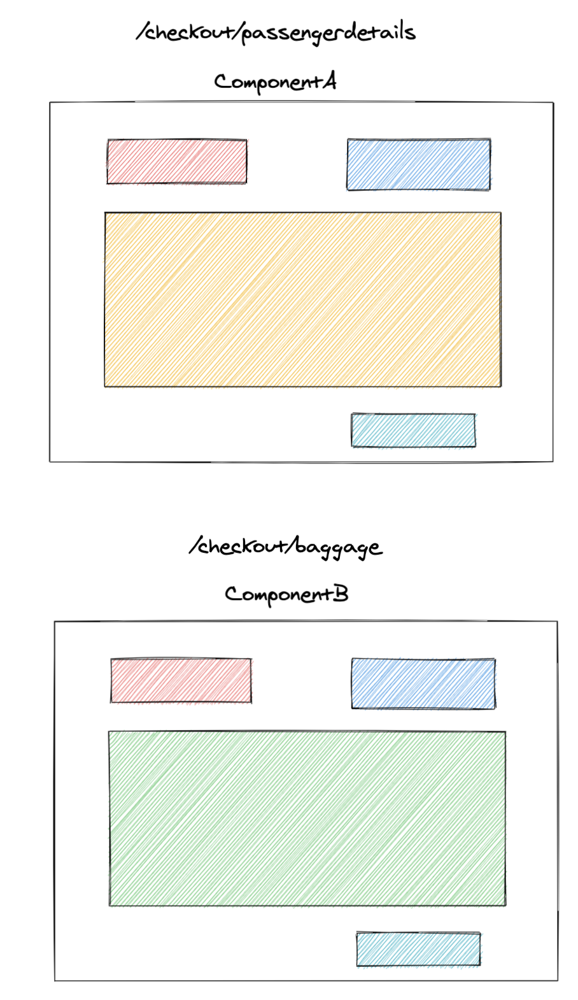
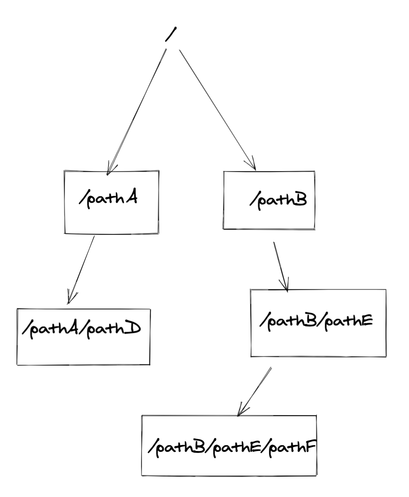
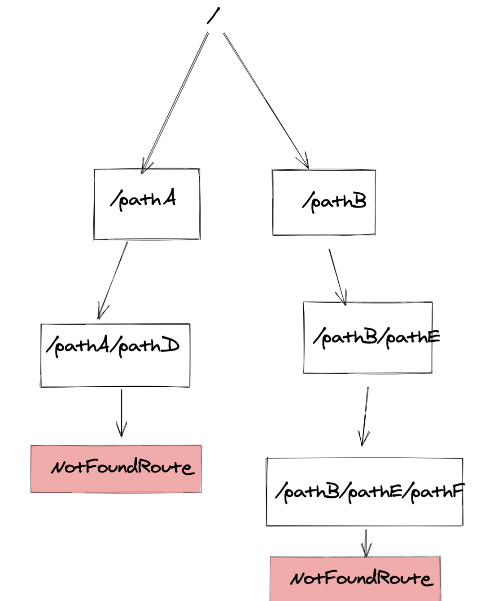

https://unsplash.com/@introspectivedsgn


Any one who works with react must have worked with `react-router`.
React router is one of the most used router in react community.
It allows us to write `Routes` in nested forms. Routes are nothing but React components. Nested Routes have advantages when we want to show sub parts of pages based on conditions. Nested routes also cause less remounts as only the content for the nested route will mount again.


## Bit of why we need nested routes

Let's say we have a route system like this:

```jsx
<Router>
  <Route path="/checkout/passengerdetails"><ComponentA /></Route>
  <Route path="/checkout/baggage"><ComponentB /></Route>
</Router>
```





Now if we don't have nested routes, the whole `ComponentA` will unmount and `ComponentB` will mount. 

>Is that good ? 

Well, it's how much love you have for performance over ease of writing. I would definitely say this way of writing routes is easy and straight forward. 


But what problems exists with this routing ?

In the above diagram I have given color to the components, notice the common colored boxes between both the routes. Only the center component has changed between both the routes.
The route change from `/checkout/passengerdetails` to `/checkout/baggage` cause a complete unmount of all the components , even for the components which need not change with the route.


This is the exact situation where nested routes can be a great  boon.

we can prevent the unmount of entire page by writing routes like this:

```jsx
function SomeComponent() {
  return (
    <>
      <CommonUI />
      <Switch>
        <Route path="passengerdetails"><PassengerDetails /></Route>
        <Route path="baggage"><Baggage /></Route>
      </Switch>
      <Footer />
    </>
  );
}

function App() {
  return (
    <Router>
      <Route path="/checkout">
        <SomeComponent />
      </Route>
    </Router>
  );
}
```

In the example above notice , how `CommonUI` and `Footer` will not unmount when the route change happens.

That's short gist of what can be achieved from nested routes.


## Challenges with Nested Routes

One of the major challenge with nested routes is to handle `Not found` pages. Now as the routes are nested , there is no one place to keep the `Not Found` route. You have to place the not found route at the very end of nested routes.

See the diagram below to understand more.

Let's say we have following route structure currently.




Now let's suppose we hit urls which looks something like these:


How would you handle these routes to show 404 custom screen as none of routes matched ?

You can add `NotFound` component the end of every branch in tree diagram. Below is the diagram showcasing that:




This solution will work but it is not the best possible due to one of the major drawback which is :

Any new branch of route you introduce, you will have to add `Not found` component at the very end always. So more surface area, there will be more chances of mistakes.

---

> What can we do to fix this issue ? . Our goals are following:

1. A centralized way of handling the 404 pages.
2. There should be no need to manually add `Not Found` Routes.


## Solution 

We can do it if we can write a custom `Custom Switch` component, which add a `Not found` route automatically at the end of the every route branch. So instead of `Switch` component from react-router-dom we will be using `CustomSwitch` everywhere


That simple component will look something like this:


```jsx
import {
  Switch,
  useRouteMatch,
} from "react-router-dom";

function NotFoundPage({ CustomNotFoundPage }) {
  const history = useHistory();
  useEffect(() => {
    history.push("/notfoundpage");
  }, []);
  return null;
}


function CustomSwitch(props) {
  const { children } = props;
  return (
    <Switch>
      {children}
      <NotFoundPage />
    </Switch>
  );
}
```

And a `Not found` route at the top of all the routes in our application. Preferably where you are rendering your base route.

You can also make use of `useRouteMatch` in the component to check whether a `Not found` is rendered.

## To summarize :

CustomSwitch will add the `Notfound` route at the end of very `Switch` block. No need to add  NotFound routes manually. Whenever a Not found component is rendered, it will redirect  to `/notfoundpage` due to logic that we have written in NotFound Component

Here is the codesandbox link for the example:

<iframe src="https://codesandbox.io/s/react-router-nesting-forked-o3gtp?file=/example.js:176-338&fontsize=14&hidenavigation=1&theme=dark&view=preview"
  style="width:100%; height:500px; border:0; border-radius: 4px; overflow:hidden;"
  title="practical-firefly-i5yly"
  allow="accelerometer; ambient-light-sensor; camera; encrypted-media; geolocation; gyroscope; hid; microphone; midi; payment; usb; vr; xr-spatial-tracking"
  sandbox="allow-forms allow-modals allow-popups allow-presentation allow-same-origin allow-scripts"
  ></iframe>


 

What if we have two `CustomSwitch` component at the same level. Then the first `CustomSwitch` may throw off you to `notfound` page. But this scenario , I haven't ever faced while working on application. Just point it out here for the sake of clarity and unseeable gotchas.


That's all for now. There are one corner case with the solution which i can think when i am writing the article.


Thanks and let me know in comments what you liked and what you didn't like.


