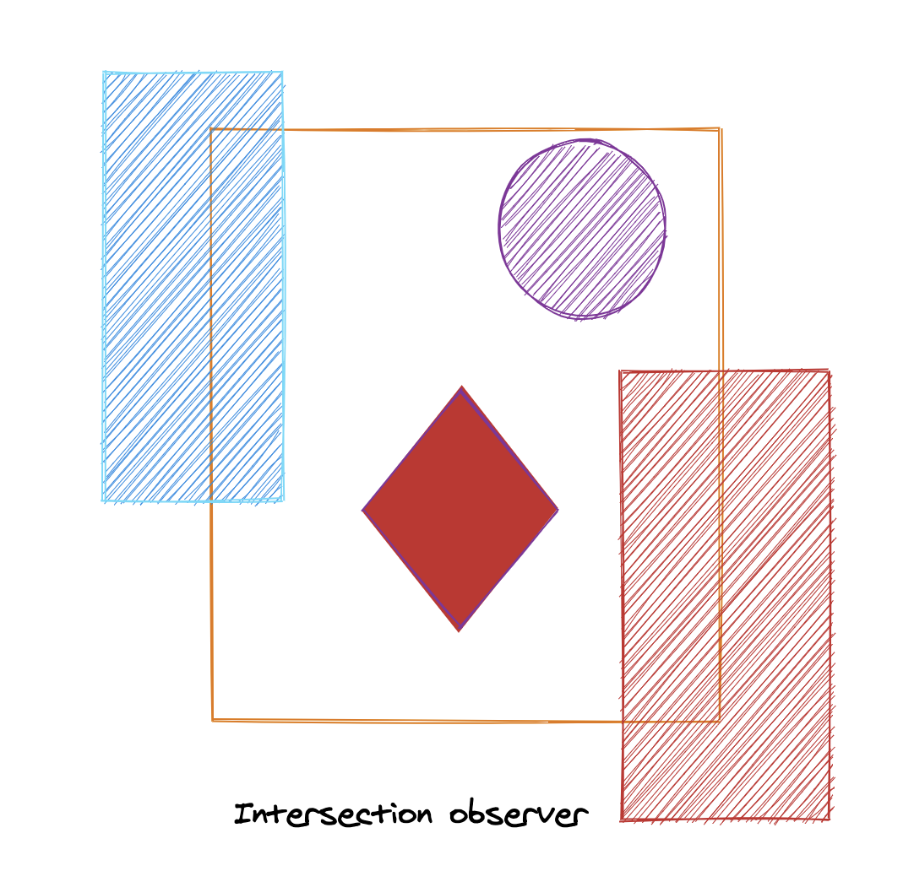
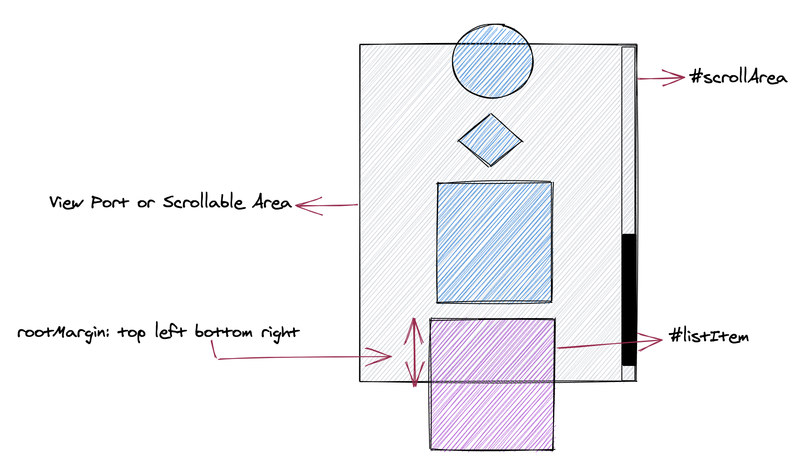

[Image built using Excalidraw](https://excalidraw.com/)

**Have you guys heard about intersection observer ?**. It' a cool web technology which allow us to observe the element on any page efficiently. It has a great browser support and [polyfill](https://github.com/w3c/IntersectionObserver) is also there. In this article, I am going to explain intersection observer and a hook based on it.

---

### Intersection Observer

The formal definition is available on [MDN Intersection Observer](https://developer.mozilla.org/en-US/docs/Web/API/Intersection_Observer_API). But to the people who are cool with an informal explanation to intersection observer can stay with me for this section. So, Let's start !!

Before I starts with some code. Let's see what intersection observer does.

> It basically tells you how much of the proportion of a DOM element(or target element) is
> visible in the area covered by a root element.

So whwnever you need to decide whether an element is visible in the parent's area, you should think of intersection observer.

One of the best part is that you do not need to take care of screen resizes, It takes care of that automatically.

It **asynchronously** observe changes in the proportion changes. Hence very performant.

Let see some visuals to understand it more :



`gist:simbathesailor/0ef2579026dc77ad78f5f571caf58551`

Notice both, image and the code snippet.

Intersection Observer is a constructor function. which you can call with options and callback.

```jsx
let observer = new IntersectionObserver(callback, options)
```

Let's say now we want to observe the DOM element with id **#listItem**. We can do that by following statements.

```jsx
let target = document.querySelector("#listItem")
observer.observe(target)
```

To start unobserving the same element, we can write following statement:

```jsx
observer.unobserve(target)
```

Let's see the options also:

1. **#scrollArea** is the root element. If passed nothing it will take browser view port.

2. **rootMargin** is the distance between the parent boundary and the target element boundary. Notice the image above and think if this point makes sense there. Frankly speaking trying out few examples will help you more.The values looks very similar to how we give margin, padding in css. (top, left, bottom, right).

3. **threshold**: is the proportion of target elment visible, when intersection observer runs the callback. E.g, 0.25 means 25% of target element is intersecting.

**callback** gets called with complete entry object and observer , which gives information about the observer, target element and root element. You can read more about it here. [Entry object](https://developer.mozilla.org/en-US/docs/Web/API/IntersectionObserverEntry)
You can place your logic in response to the intersection change inside this callback. This callback is the place where you will sepending most of your time.

`gist:simbathesailor/ec77b87d3a550f3cc085c191f3744340`

Now as we have discussed intersection observer, let's see some code for intersection observer reactjs hook.

**Note: This section below article assumes an intermediate understanding of React.useRef, React.useCallback, React.useReducer and React.useEffect. If you haven't read them. Please give it a read at [Reactjs hooks](https://reactjs.org/docs/hooks-intro.html)**

Before I start getting into implementation, I think it's better to look at the hook API first. Then we will work backwards.

```jsx {18-22,24,31}
// optional
const defaultVisibilityCondition = entry => {
  if (entry.intersectionRatio >= 1) {
    return true
  }
  return false
}

// optional
const options = {
  rootMargin: "0px 0px 0px 0px",
  threshold: "0, 1",
  when: true,
  visibilityCondition: defaultVisibilityCondition,
}

const App = () => {
  const [
    isVisible,
    targetElementRef,
    rootCallbackRef,
  ] = useIntersectionObserver()

  // Can also send  options
  // const [
  //  isVisible,
  //  targetElementRef,
  //  rootCallbackRef
  //  ]
  // = useIntersectionObserver(
  //   options
  // )

  return (
    <div className="App">
      <div ref={targetElementRef} className="box">
        {isVisible ? "Box is visible" : "Box is not visible"}
      </div>
      {isVisible ? "Box is visible" : "Box is not visible"}
    </div>
  )
}
```

## Return Data Types and Description

The hook returns an array. Let's say that array name is **Arr**.

1. **isVisible (boolean)**: Tells whether the target element is visible or not

2. **targetElementRef (Function)**: The target element ref. You have to add it to target element

3. **rootElementCallbackRef (Function)**: The root element ref, You can add it to root element or can just leave it if document is the root

4. **observer (Intersection observer Object)**: Observer object itself

---

Notice above that we are not passing the refs from the App component, but we are getting refs back from the the useIntersectionObserver. This is good because the consumer of this hook doesnot have to create an ref and send it to the hook. Less work for consumer. I have explained this kind of pattern in this [article](https://simbathesailor.dev/useful-patterns-with-react-hooks/).

Now we need to construct the observer object using **IntersectionObserver** constructor. We also need to put it inside useEffect because we want to watch for options changes. Following code is the crux of this hook.

```jsx
React.useEffect(
    () => {
      if (!checkFeasibility) {
        return;
      }
      // Target element
      const currentELem = targetElement;
      // Root element
      const currentRootElem = rootElemNew;

      if (when) {
        // creating intersection observer object
        let observer = new IntersectionObserver(callbackRef.current, {
          root: currentRootElem || null,
          threshold: threshold.split(",").map(elem => parseFloat(elem)),
          rootMargin
        });
        observerRef.current = observer;
        // starts observing
        if (currentELem && observerRef.current) {
          observerRef.current.observe(currentELem);
        }
      }

      return () => {
        // cleanup
        if (currentELem && observerRef.current) {
          observerRef.current.unobserve(currentELem);
        }
      };
    },
    [targetElement, rootElemNew, rootMargin, when, callbackRef, threshold]
  );
  return [
    isVisible, // isVisible flag based on visibilityCondition.visibilityCondition
    targetElementCallback,
    rootCallbackRef,
    observerRef.current // just keeping the value of observer in a  ref
  ];
}
```

So whenever the visibility callback (options.visibilityCondition) return true, isVisible will be set to true. and accordingly the App component will get to know it.

We will see more parts ot this hooks and different pattern's decisions I took while writing this hook.

This article just touches important aspect of creating an intersection hook. But there is also other pieces of code which makes this hook consumable. But yes, I think the explanation for all that is going to take one more article.

But I will not leave you guys stranded here. I have packaged the useIntersectionObserver in a npm package. You people can try it and also see the github code if curious.

- [@simbathesailor/use-intersection-observer](https://www.npmjs.com/package/@simbathesailor/use-intersection-observer)

- [Github link](https://github.com/simbathesailor/use-intersection-observer)

Most of the patterns, I follow while writing react hooks, I have explained
in this [article](https://simbathesailor.dev/useful-patterns-with-react-hooks/).

If you find it interesting , please DM me on twitter or discuss it on reddit.

Thanks
