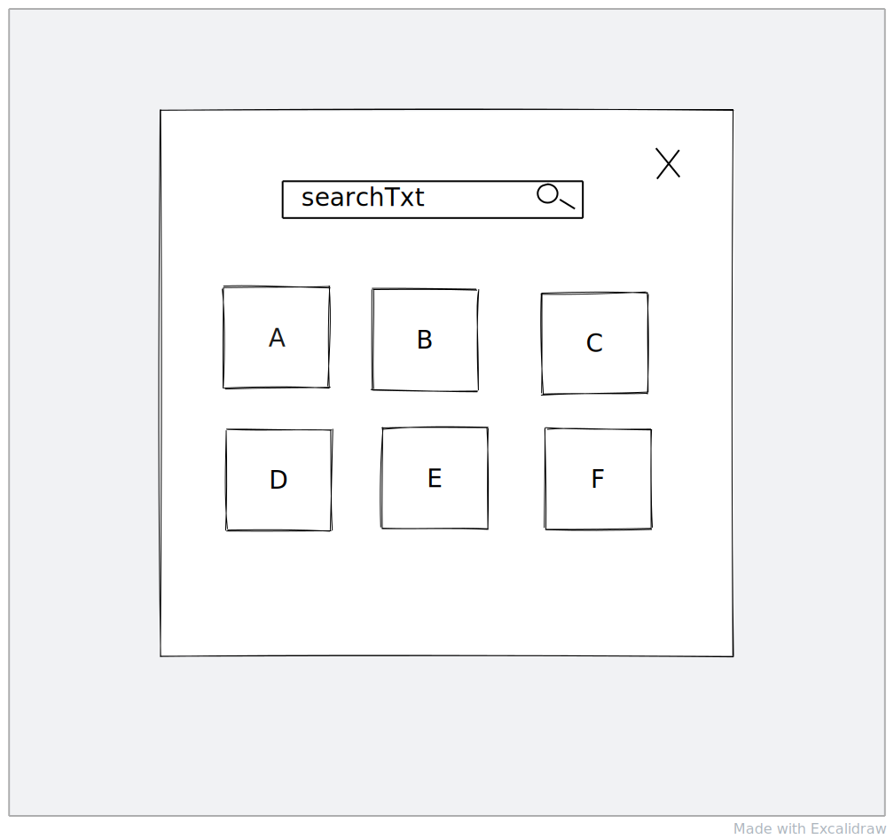

I love controlled components. Do you ?. Such a cliche question, but anyways let's talk about controlled components with hooks.

They make your components flexible. They also help you keep single source of truth for your component's data.

You never want to mix controlled and uncontrolled components. More on this here [React controlled vs uncontrolled](https://reactjs.org/docs/glossary.html#controlled-vs-uncontrolled-components).

Controlled components are better when thinking in react mindset. That way you don't have to think about the UI updates. React gives you the guarantee that UI shown to you is in-sync with your data in almost all the cases.

But creating controlled components and consuming them everytime, comes up with the some tradeoffs. You orchestrate the data in one of the higher components that renders a controlled component. Don't worry if the prior lines were a bit confusing . Let's understand this with a diagram



In the diagram we have one modal having a search box and a result section. There are two data points here:

1. Search value in input.
2. The data item array which is used to render cards.

This kind of modal having similar search and results is needed at multiple locations in our application.

And every place the post search logic varies. And once you have result with you, there are different logic post that. At few places you also need to set the search value programatically, on some updates.

Now this is definitely a made up situation here. But this scenario is so common in real applications.

To keep this UI completely re-useable, we will go for controlled components, rememeber I told you that I love controlled components and by now you I can assume, that you love it too.

Let's try to write component hierarchy for this situation.

```jsx
<AnyofyourComponent>
  <SearchAndResultView>
    <Modal>
      <SearchBox />
      <ResultContainer />
    </SearchAndResultView>
  </Modal>
</AnyofyourComponent>
```

This will be the rough hierarchy, we will talk in rest of the article

I will not go very deep into controlled component. But let me give you some understanding about it.

> **Controlled components** keeps the control of data with React. They rely on React to update UI in-sync with the data available to the component.

Read more about it here [Controlled components](https://reactjs.org/docs/forms.html#controlled-components)

And then there are **uncontrolled components**. which takes matter into their own hand. They imperatively change the rendered result properties. [Uncontrolled components](https://reactjs.org/docs/uncontrolled-components.html#gatsby-focus-wrapper)

There is one more way to see at uncontrolled components. Now let's say you have a component which keeps the data with itself and the parent does not have access to it. The child component itself is in control of data and the parent can't essentially change the child component's state. In this scenario, the child component is not designed in a way where you can control on the outcomes in the child component and it will also hamper the reusability. Opposite of it is controlled component

So in our case, if the the search state and result state is with the the SearchAndResultView component, it becomes a uncontrolled component.

But if the values needed to render the SearchAndResultView are coming from the parent component, we get a controlled component.

---

Let's see how a parent component will use this child component.

`gist:simbathesailor/43c67b031a14297c19bbe7e21d9f4c76`

Note: There are better way of organizing the current component hierarchy, but let's focus on only the controlled component stuff.

Notice, what all we needed to do to make use of SearchAndResultView.

We have to have two states , one for search and one for result. In some scenarios, these kind of definitions becomes so big and scattered. Next time you try to use the component, it eats away your whole time

We have to do similar kind of thing everywhere we are using this SearchAndResultView component.

This is how fundamentally controlled compoents system works in reactjs. There is nothing wrong about it. But, Can we remove this repeated work ?

Yes we can, that's why this blog 😄

---

Now let's observe the below snippet

`gist:simbathesailor/0bbc238a248fd58f10fb9209a0ceaa0b`

Notice, how the statments for defining states are now moved to **useSetup** hook. Now , every component that want to use the SearchAndResultView doesn't have to write the state definitions first to use the controlled component.

They can make use of controlled component's **setupHook**

This way of writing controlled components have surprisingly improved my experience of working with controlled components. It's a simple , but yet powerful way of writing components in Reactjs. This could not have been possible without React hooks.

You have complete control to change the value of SearchAndResultView component anytime you like. This way we have all the controlled component benefits and also the ease of use.

Thanks

- [Anil Chaudhary](https://twitter.com/simbatheesailor)
