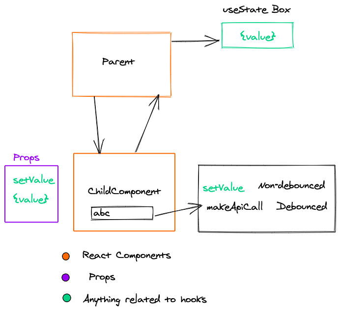

The other day I was working on a controlled component and I want to debounce certain actions and not debounce certain actions at the same time in useEffect. I start wondering , Can we have a debounced effect ?
While answering this question in my mind, I went through few ideas which are good in their respective scenarios. Now I think it is worth sharing all those ideas and a debounced effect itself that I was able to write finally.

Let's see the problem at hand and then we will see various approaches to solve it.

`gist:simbathesailor/709974316e8268b195fece9bc95a561c`

Notice above **App** and **ChildComponent**. The input in child is dependent on the parent component for it's value. We call it as [Controlled component](https://reactjs.org/docs/forms.html#controlled-components). Some people must be thinking why I have to keep the value in parent component? Why I can't keep it in Child Component. The answer is , these scenarios are pretty common in all real world applications. For example, I had the following case:

The input value was kept in Redux store, because it is used at other locations in app to determine certain behaviour. That's where I started thinking about a debounced effect.

Hence an example based on controlled components.

Notice few things above.

**1.** OnChange function need to do two things.

**2.** A non-debounced change which changes the value. It can't be debounced. Making it debounced will stop the values to reflect in the input as it is a controlled component.

**3.** A debounced change. In the above example we are just logging something but in real application it can be anything e.g making api call, updating filter e.t.c. That has to be debounced for the performance sake.

Here is an image showing the visual representation of what's going on here. Made with [excalidraw](https://www.excalidraw.com). Quite smiple and amazing to use.



### First Try :

`gist:simbathesailor/fe73dc6cefd6f59d50730bd65e9bacfa`

Notice above our **makeApiCallRaw** is not dependent on any thing in the component and its all good to move the pull the functiin outside of the component. In this case the makeApiCallRow will be debounced.

But as you must be thinking this is not always possible to do. And you are right.

So let's try 2nd approach.

### Second Try

`gist:simbathesailor/1d00a0ac510b3577b9c6e5eb6c458569`

Notice we bring in **debouncedmakeApiCall** inside the **ChildComponent**. We are making use of useCallback to persist the reference of function intact across rerender. And it works correctly. Checkout this codepen link.

https://codepen.io/stack26/pen/qBExgGV?editors=1011

But this approach is more or less same as the first one. If you can do this method, you can very well
do the first method. With the useCallback and blank dependency, the closure is going to get created only once for the callback passed. It means the returned value from useCallback function will return same function reference across rerender.

```jsx
const returnedCallback = React.useCallback(() => {}, [])
// returnedCallback will point to same function, until the component unmounts
```

If the debouncedmakeApiCall is dependent on any other value (e.g props, any variable in scope), the new values will not get reflected while the debounce function runs.

```jsx
const returnedCallback = React.useCallback(value => {
  // using some value available in the scope
  makeApiCallRaw(value, someValueFromOuterScope)
}, [])
```

Now someValueFromOuterScope will keep on referring to its initial value across rerender. To see this case, lets add something to our callback as dependency and see the results. We only have **value** variable available in outside scope. So let's add it.

https://codepen.io/stack26/pen/MWYQxVo?editors=1111

Notice how the effect runs for all the value changes.
It is definitely something which we don't want to happen.

> So what approach should be followed?. The second approach looks quite useful ,but has the problem of changing its reference for every run.

One way we can do is to remove all the dependencies from dependencies array and pass all of them as the arguments to the debounce function. We solve both the issues.

**1.** The reference to the function will remain persisted across rerender.

**2.** The debounce function will be getting all the latest values. No stale data and no closure issues.

Here is the running code example.

https://codepen.io/stack26/pen/QWwmoEL?editors=1011

Notice **debouncedmakeApiCall** is dependent completely on arguments for latest values.

But then, Is it always possible ? So far , it worked out for me. But still it brings in lot more verbosity, if the callback is dependent on many values in the function scope.

### Third Try

> Can we have a **debounced useEffect** ?

The API can be very similar to useEffect plus some debounce specific arguments.

```jsx
useDebouncedEffect(callback, dependencyArr, debounceTimeout[number], {
  trailing: [boolean],
  leading: [boolean],
})
```

It can be very handy and prevent all those arguments passing and reference maintainance hustles. Any thing available in scope should be available having expected values.

Let's try this. First let me explain you the idea which has been used.

So useEffect only run again when dependency list changes.

> What if we can debounce the changes
> to the dependency list ?

If we are able to do so , we should be able to debounce the useEffect callback run also.

Yes friends. The hook we are going to write is just based on this idea. Below is the complete code.

`gist:simbathesailor/aff2228f05e2db0117314cf9329477a9`

**1** Line 9 : we are just keeping a local reference of dependency passed. The change to local \_dependency is debounced

**2** Line 24 - 28 : We are just calling the with depnency array which is nothing but dependency itself. Whenever any element in the dependency changes, the effect runs it's callback.

**3** Line 12 - 22: we are making use of the same approach we talked in Try 2. Making use of callback and making sure the reference to the makeChangeTodependency remains constant across rerender.

Here is the working codepen link:

https://codepen.io/stack26/pen/YzPeojM?editors=0111

Start typing in the input box and see the useDebouncedEffect running after 2, 3 and 5 seconds.

**Check the console logs**

**But there is one problem, have you noticed it ?**

The first run of callbacks is not debounced. They just run without 2, 3 and 5 second wait for the first time.

This can be unacceptable at certain scenarios. But I think this should be managable by adding checks.

> Why it ran for the first time ?

Because we cannot debounce the first run.

For not running in the first run, we can add checks to our custom hook but remember the hooks cannot be used inside conditional. They have to be used only at the first level in function.

Although, we were able to write a debounced hook, it has it's own shortcoming. Dependending on the scenario it can be useful. I think the last approach can be little non-deterministic to work at times in terms of debugging. 2nd approach is more deterministic. But still I don't like the verbosity of second approach. I think I have to agree with this tradeoffs involved.

So the method 2 is the most right solution at this point in time but not the elegant solution atleast for me.

Thank you guys, if you are still with me 😄 !! Has any one of you have tried writing a debounced hook ?. Were you able to do it ?. If yes Please share and if not still share any problems with react hooks. Hit me up on twitter.

https://twitter.com/simbatheesailor
