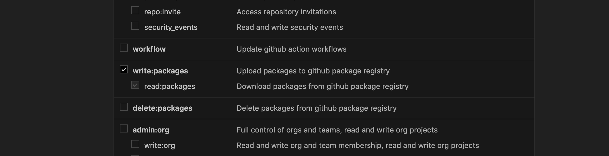
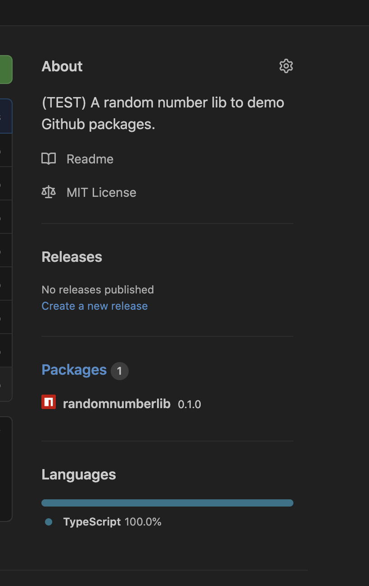

Photo from https://unsplash.com/@element5digital 


Github packages have been around for a while now. As a developer we spend so much time on github either for our office work or for opensource projects.


Couple of months back , our team rolled out a design system, which have a library component also. These library have to be hosted somewhere so that , we can consume it in various projects.

The installation should be very similar to how we do it today mostly with frontend projects using `npm install / yarn` 

We were already having teams licence for organization. we were having  all our codebases available on github already. Github packages seemed very legit as an option for private package hosting. We are anyways getting it with the existing licence. 

---
In this article, I am going to explain how we can publish and consume Github packages *(private/public)* and also what changes needs to be done in *Dockerfile* to get the installs working for docker builds

---

Let's see how we can get it done. 

### PACKAGE CREATION

**Note: If you have js based packages ready , Please  dive directly into next section:** which is [Publish packages](/github-packages/#publish-package)

You can create packages in javascript ecosystem using **webpack, rollup or grunt/gulp** e.t.c .

We used  [TSDX](https://github.com/formium/tsdx) which is an excellent library creation helper. I also used lerna [Lerna](https://github.com/lerna/lerna) for versioining of packages.

Let's create a simple packages which just give me random numbers between any two numbers. The example is kept trivial to keep the attention into the most important aspect of this article which are *Github Packages*

Run 

```sh

npx tsdx create randomnumberlib

```


Pick name of your choice for this library, I have chosen `randomnumberlib` name. We are going to use `https:npm.pkg.github.com`(This is packages namespace for npm with github packages) as the registry for this package. Other languages have their own registeries. 

Read more here : [Github Packages with npm](https://docs.github.com/en/free-pro-team@latest/packages/using-github-packages-with-your-projects-ecosystem/configuring-npm-for-use-with-github-packages) & [Supported github packages client and namespaces](https://docs.github.com/en/free-pro-team@latest/packages/learn-github-packages/about-github-packages#supported-clients-and-formats)


The tsdx command will create a folder , just navigate to the folder in terminal and add your library code. I have added the following code in 

`src/index.ts`
```javascript
  let times = 0

  export const random = (min: number, max: number): number => {
    if ('development' === process.env.NODE_ENV) {
      console.log(`boop ${++times}`);
    }
    
    return Math.ceil(Math.random() * (max - min) + min)
  };

```

My function does nothing more than returning a random number between min and max.


### PUBLISH PACKAGE

If you have the package already or you have created a package using the steps in above section, let's dive into how to publish the package.


> As it is a github package make sure the package name is in this format `@[username]/[packagename]`. In my case it is `@simbathesailor/randomnumberlib`

`simbathesailor` is mygithub username and `randomnumberlib` is the library name


The name attribute in the package.json can be changed to the required package name.

First step is to generate a personal access token from https://github.com/settings/tokens.

1. Generate the one with read and write packages permission. Copy the token and keep it handy as it is going to be needed soon.



2. Run the following command to login to registry.

```
 npm login  --registry=https://npm.pkg.github.com

```
It will prompt for username. Put you github username

Next, it will ask for password: Paste the token generated in step 1.

Next , enter your email attached to your github account against which you want to publish the package.

If every thing works, you should see the message stating that you have successfully logged in.

3. Next step : Just run publish command for you library. Run `npm publish`.

This `npm publish` will trigger a fresh build(due to prepare npm hook in tsdx, can be different for you) and then will try to publish the package.

By now, you should see the github repository listing package on right handside, somewhat similar to the below snapshot.




### Consuming Package [PRIVATE]

1. Create a .npmrc file at the level parallel to your package.json file of your project.
2. Add following content to the .npmrc file.

```
@[USERNAME]:registry=https://npm.pkg.github.com/
//npm.pkg.github.com/:_authToken=[YOURTOKEN]
```
Replace `USERNAME` and `YOURTOKEN` with the orgname/username and github token(with read packages right) respectively.

If you don't want to add this file at repository level. You can also keep the same in ~/.npmrc.

3. Add .npmrc in .gitignore. Because we definitely don't want to commit token to github.

4. Then just do the normal package install by running below command

```
npm install
```
If every steps worked fine above, the install would have happened successfully.

To consume a public github package, you can just get rid of follwing line from .npmrc

```
//npm.pkg.github.com/:_authToken=[YOURTOKEN]
```

And That's it voila,🎆 you have published and consumed a private package. 
In my opinion, now with github packages it is very easy to publish and consume private packages as the packages stays near your code. 

Also in most of the case organizations are using plans of github which autimatically allows github packages feature.


### Docker Install

Add the following content to your docker file. Not all the part is relevant,but the part where I am adding github token can be noticed more carefully

```dockerfile

ARG GENERATE_SOURCEMAP
ARG GITHUB_TOKEN
FROM node:12.10 as BUILD
ARG GENERATE_SOURCEMAP
ARG GITHUB_TOKEN

ENV GENERATE_SOURCEMAP $GENERATE_SOURCEMAP
ENV GITHUB_TOKEN $GITHUB_TOKEN
WORKDIR /usr/src/app
COPY package.json .

# Notice part below this line
# This is needed for installing private github packages
RUN echo //npm.pkg.github.com/:_authToken=$GITHUB_TOKEN >> ~/.npmrc
RUN echo @[USERNAME]:registry=https://npm.pkg.github.com/ >> ~/.npmrc
RUN yarn install
# Removing the github token from npmrc file in below line
RUN echo > ~/.npmrc
# Notice part above this line
ADD . /usr/src/app

RUN yarn run build
FROM node:12-alpine3.9
COPY --from=BUILD /usr/src/app .
EXPOSE 8001
CMD ["node", "start.js"]

```

Replace `USERNAME` with the your package username/organization.

There are some issue with how the scoped packages are handled via .npmrc. You cannot tell npm to download the packages from different registry at package level. Currently it is at scope level. Below is the ticket that I filed
[https://github.com/npm/cli/issues/2307](https://github.com/npm/cli/issues/2307)

Finally I am  going to provide the link where i am consuming the private package. I have added a sample npmrc file also for the reference.

[Consumer Example](https://github.com/simbathesailor/consume-random-number-lib)


That's all . Best of luck !!


