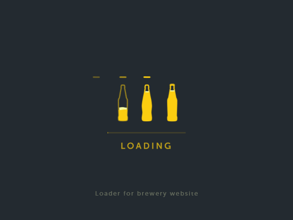

<figcaption>Photo by <a href="https://unsplash.com/@rosssneddon">Ross Sneddon</a> on <a href="https://unsplash.com?utm_source=medium&amp;utm_medium=referral">Unsplash</a></figcaption>

## Introduction

Hello there, fellow devs! Welcome to a thrilling journey into the world of ReactJS. In this blog post, we are going to explore one of the most cutting-edge technologies that have recently shaken up the ReactJS ecosystem – React Server Components! So, fasten your seatbelts, and let's dive right in.

### Meet Your Guide

Before we embark on this exciting adventure, let me introduce myself. My name is Anil, a Full Stack Software Engineer working at Google. With over a decade of experience across various technologies, I've spent more than 7 years immersed in the captivating world of ReactJS. Throughout my journey, I've published numerous articles and contributed to open-source libraries.

## The Game-Changing Paradigm Shift

React Server Components are nothing short of a game-changer, akin to the groundbreaking impact we experienced when React hooks were introduced. Today, we are going to explore the transformative power that React Server Components bring to the table.

1. **Granular Control Over Client-Side JavaScript:**
   The first major benefit of React Server Components is the unprecedented control it gives developers over client-side JavaScript. Imagine this scenario – your client-side ReactJS SPA requires a substantial amount of JavaScript before the page becomes interactive. The more JavaScript, the longer it takes for your users to experience your page's interactivity.

With React Server Components, you gain the power to decide whether a component should be a server component or a client component. Server components are exceptional; they never send any JavaScript to the client. Instead, they gracefully deliver the final HTML – resulting in an incredibly fast initial rendering and a seamless user experience.

What's even more mind-blowing is that the component's JavaScript stays securely server-side, allowing you to use secret keys or sensitive information without any worries. This feature unlocks endless possibilities for creating full-stack applications with end-to-end JavaScript.

2. **Fetching Data within the Component:**
   In typical server-side rendered apps, data fetching is often orchestrated at the top level, where the app waits for the slowest API call to complete before generating the page's HTML. This can lead to complexity and maintainability issues, which can hinder developer productivity.

React Server Components simplify data fetching by allowing API calls directly within the component. The logic becomes more intuitive, and you can even use suspense boundaries to add placeholders or loaders for components that require data from slower APIs. This granular control over rendering and user experience is a game-changer.

Data calls within React Server Components are a breeze. Simply place the API call within the component itself, and the logic becomes more intuitive, maintainable, and well-organized.

### A Computation Engine on the Server

Think of React Server Components as a powerful computation engine on the server. You can request the server to handle heavy tasks and then gracefully pass down the results. Let's take an example of a QR code scanner, which may come with a larger-sized third-party library. Without React Server Components, integrating this QR code component would increase your JavaScript bundle size, affecting performance.

But with React Server Components, you can simply declare the QR code component as a server component. The server generates the QR code image and sends only the encoded string to the client – minimal, fast, and efficient!

## Conclusion

In conclusion, React Server Components are the dawn of a new era in web development. Their ability to bring granular control over client-side JavaScript and to handle data fetching within components is revolutionary. This technology unlocks endless possibilities for creating performant and interactive web applications.

As we've merely scratched the surface of this mesmerizing technology, stay tuned for more in-depth code examples, exciting demonstrations, and valuable insights in our upcoming blog posts and videos.

Namaste, my fellow developers! Happy coding and stay curious.
