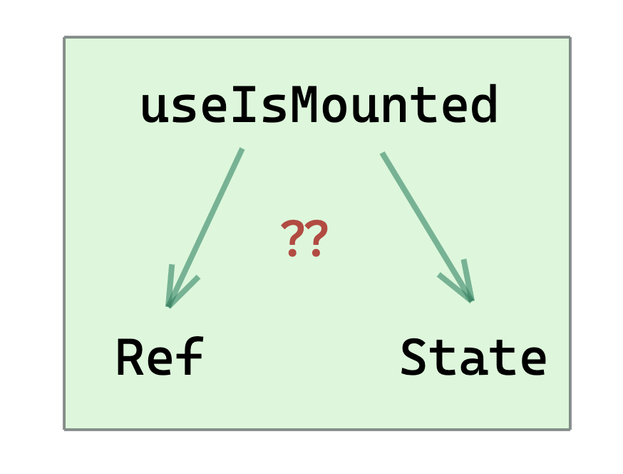

We moved from class based components to function based component with hooks. Hooks provide us better ways to use react features without sacrificing the developer experience.

The ways to use React features has changed , but not the needs of the applications. Application still need to fire API calls on mount of the components. They still need to respond to state and props changes. That means we need to serve those needs even with hooks.

We have **ComponentDidMount** function in class based components, where we do API calls or any side effect that we need to run after component is available in DOM.

> How do we handle it in function based components ?

We have one official hook which runs after layout and paint of the component. The name of the hook is useEffect. It surely looks like the right candidate for achieving our job.

```jsx
React.useEffect(() => {
  // Runs once after commit phase
}, [])
```

The callback will run only once after the render of the component.

But sometimes, we have different usecases like we want to perform some sideEffect on all updates but not on mount. How do we do that ?.

There are basically two approaches which I have seen and used.

**1.** Ref way

**2.** State way

I have seen Ref approach being used mostly, but there a problem with this approach. We will see that in a while.

### Ref way

`gist:simbathesailor/2e6a17f1f9423b058e0e006e8e8a88be`

It can be consumed like the way shown below:
`gist:simbathesailor/5f358866dba926d5cc504e9a601e7393`

See it in action here :

https://codepen.io/stack26/pen/dyPxpKj?editors=1010

Notice, useEffect in App component run properly when the component is mounted. "I am mounted" gets logged properly.

But what if we have any logic which is based on isMounted run outside useEffect. Notice the logged value, "isMountedRefApproach.current". It still shows value as false, even if the component is mounted.

The log will print correct value only if App component rerenders.

So, as you noticed that going with the ref approach can be problematics at times when you are using isMounted flag outside useEffects. Hence, the soultion is not that great.

Let's try same thing with useState approach.

### State way

The custom hook can look like this:

```jsx
const useIsMounted = () => {
  const [isMounted, setisMounted] = React.useState(false)
  React.useEffect(() => {
    setisMounted(true)
    return () => setisMounted(false)
  }, [])

  return isMounted
}
```

Now lets see the usage:

`gist:simbathesailor/69a213b525b51c06959647a740fc71f2`

See it in action here:

https://codepen.io/stack26/pen/VwYvmbZ

Notice how render happens with the latest value of isMounted. Check the console log to see the difference from the useRef approach.

> Some people might say,
> oh! this approach cause extra rerender.

Yes, it will cause one more re-render, but then this approach will work consistently in all the scenarios. We will never hit the confusion wall or bugs with this approach.

Anyhow the ref approach is not full proof and will land you in buggy situations.

And let's not crib about that one extra rerender and think about the consistensy.

Happy coding 😎😎

Thanks !!
