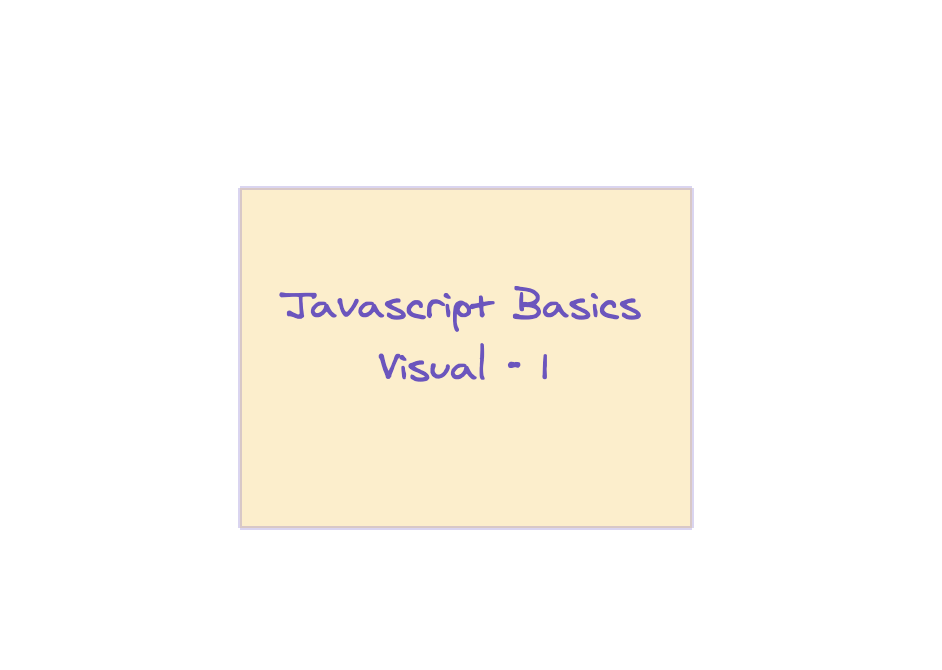
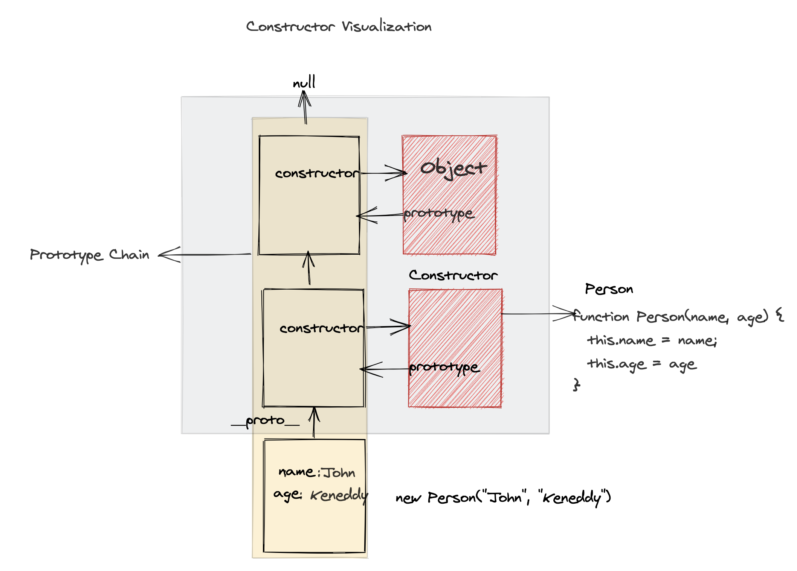
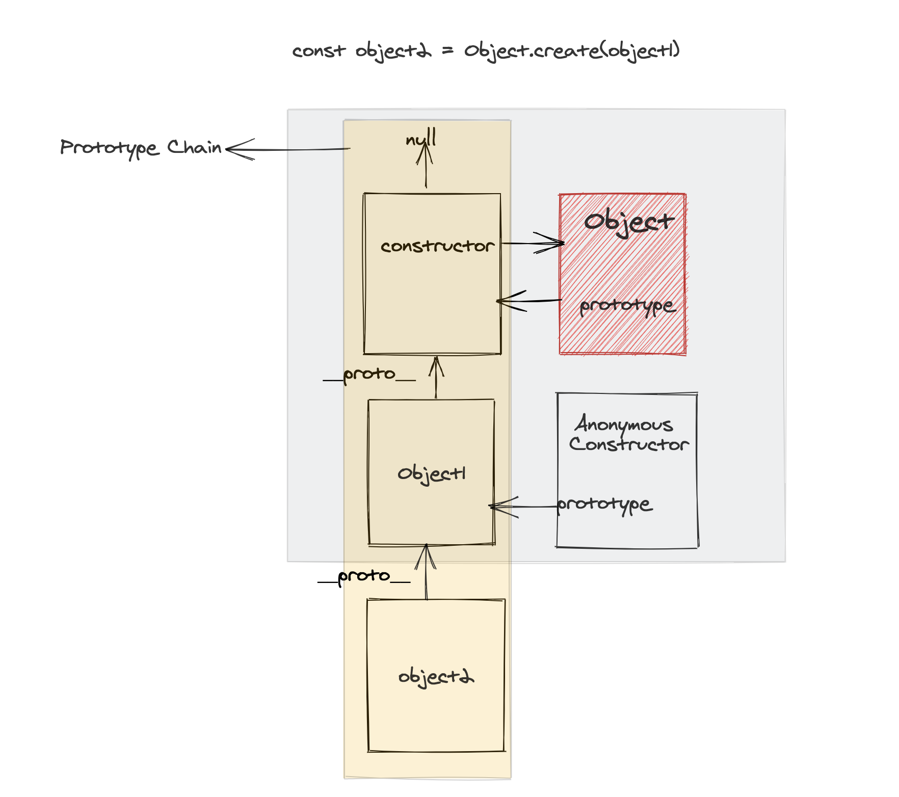
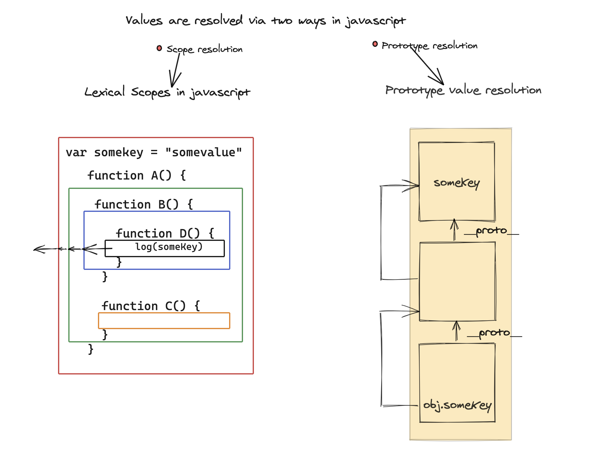

So I have been writing javascript for over three years. I have certain visualizations of javascript concepts in my head. I want to share those visualizations with everyone. **There are primarily two goals:**

**1.** Making it helpful for other developers to visualize.

**2.** Getting the feedbacks from community, if I am wrong somewhere , so that I can improve myself.

[Excalidraw](https://excalidraw.com/) is an amazing tool, which helped my visualization come to life.

There will mostly be diagrams and less explanation. The approach may differ depending on the topic.

The articles will not be for someone who has just started learning javascript. I would suggest to go through some javscript basics from websites like [MDN](https://developer.mozilla.org/en-US/docs/Web/JavaScript) before reading the rest of the article.

I will try to write the javascript basics as much as possible with visual approach in this series.

---

### Constructor Function

What happens when you do

```javascript
function Person(name, age) {
  this.name = name
  this.age = age
}
const newObj = new Person("John", "Keneddy")
```

Here is the visual representation showing the different pieces after calling 'new' for a constructor function.



---

### Object.create

What happens when you write following code:

```javascript
const object2 = Object.create(object1)
```

Here is what happens,



**Note**: Above example applies when object1 is created as literal object or new Object().

---

### How values are resolved in javascript ? .

Note: There are other rules also , which defines the resolution in javascript. But for most cases, the diagram below can be right mental model to think about value resolution in javascript.

There are two ways how values are resolved in javascript:

- **Scope Chains**
- **Prototype Chain**



That's all for now. We will see other concepts soon. We will be also diving into advanced concepts of javascript while I also learn them. 🤔

Thanks !! 🙏 🙏
